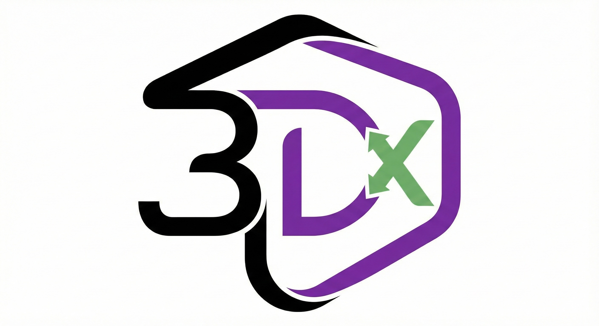
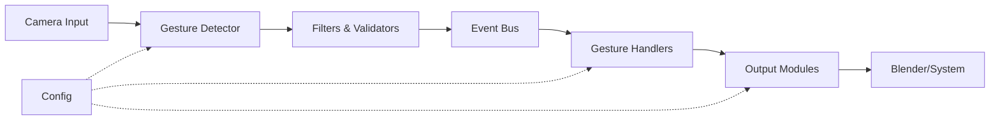

<div align="center">



# Gesture Control System

**A production-ready, AI-powered hand gesture recognition system for controlling creative applications**

[](https://www.python.org/downloads/)
[](https://google.github.io/mediapipe/)
[](LICENSE)
[](https://github.com)

[Features](#-features) • [Quick Start](#-quick-start) • [Documentation](#-documentation) • [Architecture](#-architecture) • [Contributing](#-contributing)

</div>

---

## 🎯 Overview

The **Gesture Control System** is a sophisticated, event-driven platform that enables intuitive control of creative applications through hand gestures. Built with MediaPipe and OpenCV, it provides real-time gesture recognition with robust filtering, validation, and platform-specific optimizations.

### Key Highlights

- 🎨 **15+ Production Gestures** - From basic hand poses to complex dynamic movements
- 🔄 **Real-time Processing** - Low-latency gesture detection with smoothing filters
- 🎛️ **Blender Integration** - Native addon for 3D viewport control and animation
- 🖥️ **Cross-Platform** - Optimized for macOS, Linux, and Windows
- 🧩 **Modular Architecture** - Event-driven design for easy extensibility
- ⚡ **Production-Ready** - Comprehensive testing and validation pipeline

---

## ✨ Features

### Gesture Library

#### **Basic Gestures** (6)
| Gesture | Description | Use Case |
|---------|-------------|----------|
| 🖐️ Open Palm | Flat hand, all fingers extended | Play animation, confirm action |
| ✊ Closed Fist | All fingers closed | Pause, stop action |
| 👆 Pointing | Index finger extended | Select, navigate forward |
| ✌️ Peace Sign | Index + middle fingers extended | Navigate backward, undo |
| 👍 Thumbs Up | Thumb extended upward | Approve, toggle mode |
| 🤘 Rock On | Index + pinky extended | Special action |

#### **Advanced Gestures** (9)
| Gesture | Description | Use Case |
|---------|-------------|----------|
| 🤏 Pinch | Thumb + index finger touching | Grab, select object |
| 🖱️ Pinch & Drag | Pinch with hand movement | Rotate viewport, move objects |
| ⬅️ Swipe Left | Horizontal hand movement left | Navigate, pan left |
| ➡️ Swipe Right | Horizontal hand movement right | Navigate, pan right |
| ⬆️ Swipe Up | Vertical hand movement up | Scroll up, zoom in |
| ⬇️ Swipe Down | Vertical hand movement down | Scroll down, zoom out |
| 🔄 Rotate CW | Circular hand motion | Rotate objects clockwise |
| 👋 Wave | Repeated left-right motion | Reset, cancel |
| 🅥 V-Gesture | Peace sign with tracking | Proportional navigation control |

### Platform Support

- ✅ **macOS** - Main-thread camera mode for proper permissions
- ✅ **Linux** - Threaded camera processing
- ✅ **Windows** - Threaded camera processing
- 🔧 **Auto-detection** - Platform-specific optimizations applied automatically

### Blender Integration

Control Blender's 3D viewport and animation timeline with natural hand gestures:

| Action | Gesture | Description |
|--------|---------|-------------|
| **Rotate Viewport** | Pinch & Drag | Orbit camera around scene |
| **Pan Viewport** | V-Gesture Drag | Move camera position |
| **Play Animation** | Open Palm | Start timeline playback |
| **Stop Animation** | Closed Fist | Pause timeline |
| **Next Frame** | Pointing | Step forward one frame |
| **Previous Frame** | Peace Sign | Step backward one frame |
| **Toggle Mode** | Thumbs Up | Switch edit/object mode |

---

## 🚀 Quick Start

### Prerequisites

- Python 3.8 or higher
- Webcam or compatible camera device
- (Optional) Blender 3.0+ for 3D integration

### Installation

```bash
# Clone the repository
git clone https://github.com/22cav/lauzhack2025.git
cd lauzhack2025

# Install dependencies
pip install -r requirements.txt
```

### Running the System

#### Basic Mode (Gesture Recognition Only)

```bash
python main_orchestrator.py --config config/test_gesture_only.yaml
```

#### Blender Integration Mode

```bash
# Start the gesture control engine
python main_orchestrator.py --config config/blender_mode.yaml --debug

# In Blender:
# 1. Install addon from blender_addon/gesture_control_addon.py
# 2. Enable "Gesture Control Center" in preferences
# 3. Open sidebar (N key) → Gesture tab
# 4. Click "Connect Only" to link with running engine
```

### Configuration

Edit `config/blender_mode.yaml` to customize:

```yaml
# Gesture sensitivity
gesture_sensitivity: 0.7

# Camera settings
camera_index: 0
camera_width: 1280
camera_height: 720

# Enabled gesture sets
enabled_gestures:
  - basic
  - advanced
  - navigation
```

---

## 📦 Project Structure

```
lauzhack2025/
├── 📁 config/                      # Configuration files
│   ├── blender_mode.yaml          # Blender integration config
│   ├── event_mappings.yaml        # Event routing configuration
│   └── test_gesture_only.yaml     # Standalone gesture testing
│
├── 📁 core/                        # Core event system
│   ├── event_system.py            # EventBus and event routing
│   ├── gesture_handler.py         # Gesture processing pipeline
│   ├── launcher.py                # Application launcher
│   └── modality_manager.py        # Mode switching logic
│
├── 📁 gestures/                    # Gesture recognition engine
│   ├── detector.py                # Main detection engine
│   ├── filters.py                 # Smoothing and stabilization
│   ├── validators.py              # Quality and confidence checks
│   ├── registry.py                # Gesture registration system
│   └── library/                   # Gesture definitions
│       ├── basic.py               # 6 basic hand poses
│       ├── advanced.py            # 9 advanced gestures
│       └── navigation.py          # Navigation-specific gestures
│
├── 📁 handlers/                    # Specialized gesture handlers
│   ├── blender_animation_handler.py  # Timeline control
│   ├── blender_viewport_handler.py   # 3D viewport control
│   └── modality_handler.py           # Mode switching
│
├── 📁 inputs/                      # Input modules
│   ├── gesture_input_production.py  # Production gesture input
│   └── mx_console_input.py          # Console/keyboard input
│
├── 📁 outputs/                     # Output modules
│   ├── blender_output.py          # Blender socket communication
│   ├── system_output.py           # System-level commands
│   └── loupedeck_output.py        # Loupedeck device (legacy)
│
├── 📁 blender_addon/               # Blender addon
│   └── gesture_control_addon.py  # Blender plugin implementation
│
├── 📁 tests/                       # Test suite
│   ├── test_core.py               # Core system tests
│   ├── test_gestures.py           # Gesture detection tests
│   ├── test_handler_system.py     # Handler pipeline tests
│   └── test_integration.py        # End-to-end tests
│
├── main_orchestrator.py            # Main entry point
├── requirements.txt                # Python dependencies
└── README.md                       # This file
```

---

## 🏗️ Architecture

The system follows an **event-driven architecture** with clear separation of concerns:



### Core Components

#### 1. **Event System** (`core/event_system.py`)
- Central message bus for all system events
- Type-safe event routing
- Publisher-subscriber pattern

#### 2. **Gesture Detection** (`gestures/`)
- MediaPipe-based hand tracking
- Multi-stage filtering pipeline
- Confidence-based validation
- Gesture state management

#### 3. **Handler System** (`handlers/`)
- Modular gesture processing
- Priority-based execution
- Enable/disable individual handlers
- Specialized handlers for different applications

#### 4. **Output Modules** (`outputs/`)
- Application-specific integrations
- Socket-based communication
- System command execution

### Data Flow

```
Camera Frame → Hand Detection → Gesture Recognition → Filtering → 
Validation → Event Creation → Handler Processing → Output Execution
```

---

## 🧪 Testing

The project includes comprehensive test coverage:

```bash
# Run all tests
python -m pytest tests/ -v

# Test specific components
python -m pytest tests/test_gestures.py          # Gesture detection
python -m pytest tests/test_core.py              # Event system
python -m pytest tests/test_handler_system.py    # Handler pipeline
python -m pytest tests/test_integration.py       # End-to-end

# Run with coverage report
python -m pytest tests/ --cov=. --cov-report=html
```

---

## 🔧 Advanced Configuration

### Custom Gesture Mappings

Create custom event mappings in `config/event_mappings.yaml`:

```yaml
gesture_mappings:
  OPEN_PALM:
    - command: play_animation
      modality: Control
  
  PINCH_DRAG:
    - command: rotate_viewport
      modality: Navigation
      sensitivity: 0.5
```

### Adding New Gestures

1. Define gesture in `gestures/library/`:
```python
from gestures.base import GestureDefinition

class MyCustomGesture(GestureDefinition):
    name = "MY_GESTURE"
    description = "Custom gesture description"
    
    def detect(self, hand_landmarks):
        # Detection logic
        return confidence_score
```

2. Register in `gestures/registry.py`
3. Add handler in `handlers/`
4. Configure mapping in YAML

---

## 🐛 Troubleshooting

### Camera Issues

**Camera doesn't open?**
- Check camera permissions in System Preferences (macOS)
- Try different camera index: `--camera-index 1`
- Ensure no other application is using the camera

**Poor detection quality?**
- Improve lighting conditions
- Ensure hand is clearly visible
- Adjust camera position and angle
- Increase `gesture_sensitivity` in config

### Blender Connection

**Blender not responding?**
- Verify addon is installed and enabled
- Check port 8888 is not in use: `lsof -i :8888`
- Ensure firewall allows localhost connections
- Check Blender console for error messages

**Gestures work but viewport doesn't move?**
- Verify correct modality is active (Control vs Navigation)
- Adjust sensitivity settings in Blender addon panel
- Check that 3D viewport is in focus

### Performance

**High CPU usage?**
- Reduce camera resolution in config
- Decrease detection frequency
- Disable unused gesture sets
- Close camera preview window

---

## 📚 Documentation

- [Architecture Overview](docs/architecture.md)
- [Gesture Library Reference](gestures/library/README.md)
- [Blender Integration Guide](blender_addon/README.md)
- [API Documentation](docs/api.md)

---

## 🤝 Contributing

We welcome contributions! Here's how to get started:

1. Fork the repository
2. Create a feature branch: `git checkout -b feature/amazing-feature`
3. Make your changes and add tests
4. Ensure all tests pass: `pytest tests/`
5. Commit your changes: `git commit -m 'Add amazing feature'`
6. Push to the branch: `git push origin feature/amazing-feature`
7. Open a Pull Request

### Development Guidelines

- Follow PEP 8 style guide
- Add docstrings to all public functions
- Include unit tests for new features
- Update documentation as needed

---

## 📄 License

This project is licensed under the MIT License - see the [LICENSE](LICENSE) file for details.

---

## 🙏 Acknowledgments

- **MediaPipe** - Google's hand tracking solution
- **OpenCV** - Computer vision library
- **Blender Foundation** - 3D creation suite
- **LauzHack 2025** - Hackathon inspiration

---

## 📧 Contact

For questions, issues, or suggestions:

- 🐛 [Report a Bug](https://github.com/22cav/lauzhack2025/issues)
- 💡 [Request a Feature](https://github.com/22cav/lauzhack2025/issues)
- 📧 Email: [your-email@example.com]

---

<div align="center">

**Made with ❤️ for LauzHack 2025**

⭐ Star this repo if you find it useful!

</div>
