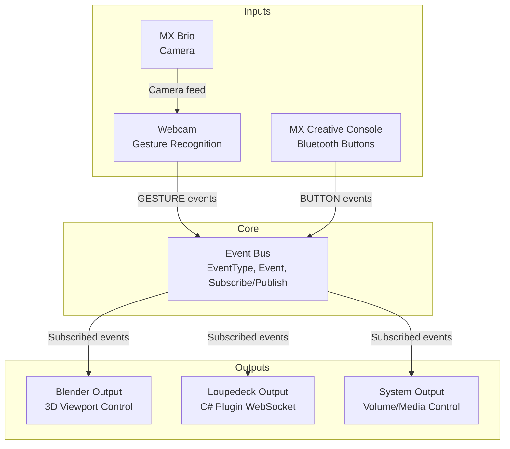

# Multi-Input Gesture Control System - Architecture

## Overview

The gesture control system is a modular, event-driven platform that supports multiple input sources and output targets, all coordinated through a central event bus.

## Architecture Diagram



## Event-Driven Design

### Core Principle

All components communicate through a central **EventBus** using publish-subscribe pattern:

1. **Input modules** detect actions and publish events
2. **EventBus** routes events to subscribed handlers
3. **Output modules** subscribe to events and execute actions

### Event Types

```python
class EventType(Enum):
    GESTURE = "GESTURE"  # Hand gestures from camera
    BUTTON = "BUTTON"    # Button presses from devices
    SYSTEM = "SYSTEM"    # System-level events
```

### Event Structure

```python
@dataclass
class Event:
    type: EventType          # Event category
    source: str              # Source module (e.g., "gesture_engine")
    action: str             # Action name (e.g., "OPEN_PALM")
    data: Dict[str, Any]    # Additional context
    timestamp: float        # Creation time
```

## Components

### 1. Core Event System (`/core/`)

#### `event_system.py`

Implements the central EventBus:

**Classes**:
- `EventType`: Enum for event categories
- `Event`: Dataclass for event data
- `EventBus`: Thread-safe publish-subscribe router

**Features**:
- Thread-safe event publishing
- Event filtering by type
- Async event publishing
- Error isolation (subscriber errors don't crash bus)

---

### 2. Input Modules (`/inputs/`)

#### `gesture_input.py` - Gesture Recognition

Detects hand gestures using MediaPipe Holistic:

**Supported Gestures**:
- `OPEN_PALM`: All fingers extended
- `CLOSED_FIST`: All fingers closed
- `POINTING`: Index finger extended
- `PINCH_START`: Thumb + index finger touch
- `PINCH_DRAG`: Hand movement while pinching (continuous)
- `PINCH_RELEASE`: Fingers separate

**Configuration**:
- `camera_index`: Camera device index
- `min_detection_confidence`: Detection threshold (0.0-1.0)
- `pinch_threshold`: Distance threshold for pinch detection
- `show_preview`: Display camera feed with overlays

#### `mx_console_input.py` - Bluetooth Buttons

Handles MX Creative Console button events:

**Status**: Stub implementation (requires Bluetooth protocol)

**Planned Events**:
- `BUTTON_1_PRESS`, `BUTTON_1_RELEASE`
- `BUTTON_2_PRESS`, `BUTTON_2_RELEASE`
- `BUTTON_3_PRESS`, `BUTTON_3_RELEASE`

---

### 3. Output Modules (`/outputs/`)

#### `blender_output.py` - Blender Integration

Sends commands to Blender for 3D manipulation:

**Communication**: TCP socket on `localhost:8888`

**Protocol**: JSON messages

**Supported Commands**:
- `viewport_rotate`: Rotate 3D view (from PINCH_DRAG)
- `play_animation`: Start timeline playback
- `pause_animation`: Pause timeline
- `next_frame`: Advance one frame
- `toggle_edit_mode`: Switch object/edit mode

**Configuration**:
- `blender_host`: Blender server address
- `blender_port`: Blender server port
- `drag_sensitivity`: Viewport rotation speed multiplier
- `mappings`: Event-to-command mappings

#### `loupedeck_output.py` - C# Plugin Client

Maintains backward compatibility with existing C# Loupedeck plugin:

**Communication**: TCP socket on `localhost:5000`

**Protocol**: Plain text, newline-terminated (e.g., `OPEN_PALM\n`)

**Compatible With**: `GestureServer.cs` in C# plugin

#### `system_output.py` - System Actions

Executes system-level actions using `pyautogui`:

**Supported Actions**:
- Media controls: `playpause`, `nexttrack`, `prevtrack`
- Volume: `volumeup`, `volumedown`, `volumemute`
- Brightness: `brightnessup`, `brightnessdown`
- Custom hotkeys: `command+c`, `ctrl+alt+delete`, etc.

**Configuration**:
- `cooldown`: Minimum time between actions (prevents repeats)
- `mappings`: Event-to-action mappings

---

### 4. Configuration (`/config/`)

YAML-based configuration for flexible event routing:

#### `event_mappings.yaml` (Default)

All features enabled:
- Gesture input → Blender + System actions
- MX Console → Blender
- Multiple output targets simultaneously

#### `test_gesture_only.yaml`

Minimal testing configuration:
- Gesture input only
- System output only
- No Blender, no MX Console

#### `blender_mode.yaml`

Blender-focused configuration:
- Gesture + MX Console inputs
- Blender output only
- Optimized for 3D workflow

---

### 5. Main Orchestrator (`main_orchestrator.py`)

Entry point that initializes and manages all modules:

**Responsibilities**:
1. Load YAML configuration
2. Initialize EventBus
3. Start enabled input modules (threaded)
4. Start enabled output modules
5. Handle graceful shutdown (Ctrl+C)

**Usage**:
```bash
python main_orchestrator.py [--config CONFIG_FILE]
```

---

## Data Flow Example

**Scenario**: User pinches and drags hand to rotate Blender viewport

```
1. [Webcam] Captures video frame
2. [GestureInput] Processes with MediaPipe
3. [GestureInput] Detects pinch (thumb-index distance < threshold)
4. [GestureInput] Tracks hand position change (delta)
5. [GestureInput] Publishes Event:
   - type: GESTURE
   - action: PINCH_DRAG
   - data: {position: {x, y, z}, delta: {dx, dy}}

6. [EventBus] Routes event to subscribers
7. [BlenderOutput] Receives event
8. [BlenderOutput] Maps PINCH_DRAG → viewport_rotate
9. [BlenderOutput] Calculates rotation from delta
10. [BlenderOutput] Sends JSON to Blender:
    {"command": "viewport_rotate", "rotation": {"x": 2.0, "y": -1.5}}

11. [Blender] Receives command and rotates viewport
```

---

## Configuration Example

```yaml
inputs:
  gesture:
    enabled: true
    camera_index: 0
    pinch_threshold: 0.05
    show_preview: true

outputs:
  blender:
    enabled: true
    mappings:
      PINCH_DRAG: viewport_rotate
      OPEN_PALM: play_animation
      CLOSED_FIST: pause_animation
  
  system:
    enabled: true
    cooldown: 1.0
    mappings:
      OPEN_PALM: volumeup
      CLOSED_FIST: volumedown
```

---

## Thread Safety

- **EventBus**: Uses threading.Lock for subscriber list access
- **Input modules**: Run in separate daemon threads
- **Output modules**: Callbacks executed in EventBus thread context
- **Error isolation**: Exceptions in callbacks don't crash other subscribers

---

## Extensibility

### Adding New Input

1. Create `inputs/my_input.py`
2. Implement `start()` and `stop()` methods
3. Publish events via `event_bus.publish(event)`
4. Add to `main_orchestrator.py`
5. Configure in YAML

### Adding New Output

1. Create `outputs/my_output.py`
2. Implement `start()` and `stop()` methods
3. Subscribe to events: `event_bus.subscribe(EventType.GESTURE, callback)`
4. Add to `main_orchestrator.py`
5. Configure in YAML

---

## Technology Stack

**Python Modules**:
- `mediapipe`: Hand/pose tracking ML models
- `opencv-python`: Camera capture and image processing
- `pyautogui`: System-level keyboard/mouse control
- `pyyaml`: Configuration file parsing
- `bleak`: Bluetooth LE communication (optional)

**C# Plugin** (Legacy):
- `.NET 6+`: Core framework
- `Loupedeck Actions SDK`: Plugin framework
- `System.Net.Sockets`: TCP server for gesture messages

---

## Performance Considerations

- **Frame Rate**: Gesture detection runs at camera FPS (~30 FPS)
- **Event Debouncing**: Only publishes on state change (not every frame)
- **Thread Pools**: Multiple connections handled concurrently
- **GPU Acceleration**: MediaPipe uses GPU when available

---

## Migration from Legacy

Old monolithic code (`GestureControlPlugin/gesture_engine/main.py`) has been refactored:

| Old File | New Equivalent |
|----------|----------------|
| `main.py` | `inputs/gesture_input.py` |
| `gesture_control_standalone.py` | `outputs/system_output.py` |
| Hardcoded WebSocket | `outputs/loupedeck_output.py` |
| Config constants | `config/*.yaml` |

All legacy files moved to `GestureControlPlugin/gesture_engine_legacy/` for reference.
